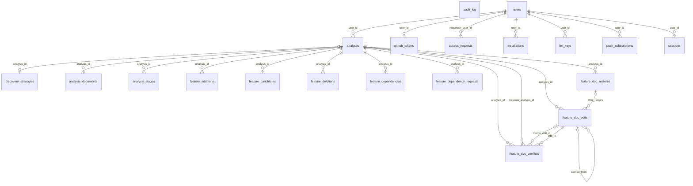

# ERD

`backend/migrations/`를 빈 DB에 전부 적용한 스키마의 지도다. 어긋나면 **스키마가 이긴다** — 이 문서를 고친다.
규칙과 체커는 [README.md](README.md)에 있다. 다이어그램은 엔티티와 관계(FK 하나 = 관계 하나, 라벨은 FK 컬럼)만
그리고, 컬럼·키·인덱스는 엔티티 절의 표가 말한다. 기본값·`CHECK`·`ON DELETE` 동작은 이 지도의 원소가 아니다.
`NULL` 칸은 엔진 카탈로그(`PRAGMA table_info`)의 값이다 — SQLite는 `INTEGER`가 아닌 `PRIMARY KEY` 컬럼에
NOT NULL을 강제하지 않으므로 `TEXT` PK도 `YES`로 보고되고, 관계의 부모 쪽 카디널리티도 그 값을 따른다.

### `access_requests`

의미: [`access_request`](../../backend/src/access_request.rs)

| 컬럼 | 타입 | NULL | 키 |
|---|---|---|---|
| `id` | TEXT | YES | PK |
| `analysis_id` | TEXT | NO |  |
| `requester_user_id` | TEXT | NO | FK → users.id |
| `created_at` | INTEGER | NO |  |

| 인덱스 | 컬럼 | UNIQUE | 조건 |
|---|---|---|---|
| `UNIQUE(access_requests.analysis_id,access_requests.requester_user_id)` | analysis_id, requester_user_id | YES | - |
| `idx_access_requests_analysis` | analysis_id | NO | - |

### `analyses`

의미: [`analysis`](../../backend/src/analysis.rs)

| 컬럼 | 타입 | NULL | 키 |
|---|---|---|---|
| `id` | TEXT | YES | PK |
| `user_id` | TEXT | NO | FK → users.id |
| `installation_id` | INTEGER | NO |  |
| `repo_owner` | TEXT | NO |  |
| `repo_name` | TEXT | NO |  |
| `branch` | TEXT | NO |  |
| `status` | TEXT | NO |  |
| `est_llm_calls` | INTEGER | NO |  |
| `est_cost_cents` | INTEGER | NO |  |
| `created_at` | INTEGER | NO |  |
| `claimed_by` | TEXT | YES |  |
| `claimed_at` | INTEGER | YES |  |
| `lease_expires_at` | INTEGER | YES |  |
| `started_at` | INTEGER | YES |  |
| `finished_at` | INTEGER | YES |  |
| `error` | TEXT | YES |  |
| `llm_language` | TEXT | YES |  |
| `public_repo` | INTEGER | NO |  |

| 인덱스 | 컬럼 | UNIQUE | 조건 |
|---|---|---|---|
| `idx_analyses_queue` | status, created_at | NO | - |
| `idx_analyses_user` | user_id | NO | - |

### `analysis_documents`

의미: [`worker_api`](../../backend/src/worker_api.rs)

| 컬럼 | 타입 | NULL | 키 |
|---|---|---|---|
| `id` | TEXT | YES | PK |
| `analysis_id` | TEXT | NO | FK → analyses.id |
| `kind` | TEXT | NO |  |
| `content` | TEXT | NO |  |
| `content_hash` | TEXT | NO |  |
| `model` | TEXT | NO |  |
| `input_tokens` | INTEGER | NO |  |
| `output_tokens` | INTEGER | NO |  |
| `created_at` | INTEGER | NO |  |
| `calls` | INTEGER | NO |  |

| 인덱스 | 컬럼 | UNIQUE | 조건 |
|---|---|---|---|
| `UNIQUE(analysis_documents.analysis_id,analysis_documents.kind)` | analysis_id, kind | YES | - |
| `idx_analysis_documents_analysis` | analysis_id | NO | - |

### `analysis_stages`

의미: [`pipeline`](../../backend/src/pipeline.rs)

| 컬럼 | 타입 | NULL | 키 |
|---|---|---|---|
| `id` | TEXT | YES | PK |
| `analysis_id` | TEXT | NO | FK → analyses.id |
| `seq` | INTEGER | NO |  |
| `key` | TEXT | NO |  |
| `title` | TEXT | NO |  |
| `status` | TEXT | NO |  |
| `detail` | TEXT | YES |  |
| `error` | TEXT | YES |  |
| `started_at` | INTEGER | YES |  |
| `finished_at` | INTEGER | YES |  |

| 인덱스 | 컬럼 | UNIQUE | 조건 |
|---|---|---|---|
| `UNIQUE(analysis_stages.analysis_id,analysis_stages.seq)` | analysis_id, seq | YES | - |
| `idx_analysis_stages_analysis` | analysis_id | NO | - |

### `audit_log`

의미: [`audit`](../../backend/src/audit.rs)

| 컬럼 | 타입 | NULL | 키 |
|---|---|---|---|
| `id` | TEXT | YES | PK |
| `user_id` | TEXT | YES |  |
| `action` | TEXT | NO |  |
| `detail` | TEXT | YES |  |
| `created_at` | INTEGER | NO |  |

| 인덱스 | 컬럼 | UNIQUE | 조건 |
|---|---|---|---|
| `idx_audit_user` | user_id | NO | - |

### `discovery_strategies`

의미: [`discovery_strategy`](../../backend/src/discovery_strategy.rs)

| 컬럼 | 타입 | NULL | 키 |
|---|---|---|---|
| `analysis_id` | TEXT | YES | PK, FK → analyses.id |
| `entries` | TEXT | NO |  |
| `approved_at` | INTEGER | YES |  |
| `updated_at` | INTEGER | NO |  |

| 인덱스 | 컬럼 | UNIQUE | 조건 |
|---|---|---|---|

### `feature_additions`

의미: [`feature_add`](../../backend/src/feature_add.rs)

| 컬럼 | 타입 | NULL | 키 |
|---|---|---|---|
| `id` | TEXT | YES | PK |
| `analysis_id` | TEXT | NO | FK → analyses.id |
| `key` | TEXT | NO |  |
| `name` | TEXT | NO |  |
| `request` | TEXT | NO |  |
| `evidence_found` | INTEGER | NO |  |
| `draft_json` | TEXT | NO |  |
| `status` | TEXT | NO |  |
| `source` | TEXT | YES |  |
| `model` | TEXT | YES |  |
| `input_tokens` | INTEGER | NO |  |
| `output_tokens` | INTEGER | NO |  |
| `created_at` | INTEGER | NO |  |
| `decided_at` | INTEGER | YES |  |

| 인덱스 | 컬럼 | UNIQUE | 조건 |
|---|---|---|---|
| `UNIQUE(feature_additions.analysis_id,feature_additions.key)` | analysis_id, key | YES | - |
| `idx_feature_additions_analysis` | analysis_id, status | NO | - |

### `feature_candidates`

의미: [`feature_candidates`](../../backend/src/feature_candidates.rs)

| 컬럼 | 타입 | NULL | 키 |
|---|---|---|---|
| `id` | TEXT | YES | PK |
| `analysis_id` | TEXT | NO | FK → analyses.id |
| `key` | TEXT | NO |  |
| `seq` | INTEGER | NO |  |
| `name` | TEXT | NO |  |
| `location` | TEXT | NO |  |
| `symbol` | TEXT | YES |  |
| `rationale` | TEXT | NO |  |
| `decision` | TEXT | NO |  |
| `reject_reason` | TEXT | YES |  |
| `merged_into` | TEXT | YES |  |
| `created_at` | INTEGER | NO |  |
| `updated_at` | INTEGER | NO |  |

| 인덱스 | 컬럼 | UNIQUE | 조건 |
|---|---|---|---|
| `UNIQUE(feature_candidates.analysis_id,feature_candidates.key)` | analysis_id, key | YES | - |
| `idx_feature_candidates_analysis` | analysis_id | NO | - |
| `idx_feature_candidates_key` | key, decision | NO | - |

### `feature_deletions`

의미: [`feature_delete`](../../backend/src/feature_delete.rs)

| 컬럼 | 타입 | NULL | 키 |
|---|---|---|---|
| `id` | TEXT | YES | PK |
| `analysis_id` | TEXT | NO | FK → analyses.id |
| `feature_key` | TEXT | NO |  |
| `name` | TEXT | NO |  |
| `reason` | TEXT | YES |  |
| `deleted_at` | INTEGER | NO |  |
| `restore_until` | INTEGER | NO |  |
| `restored_at` | INTEGER | YES |  |

| 인덱스 | 컬럼 | UNIQUE | 조건 |
|---|---|---|---|
| `idx_feature_deletions_analysis` | analysis_id, restored_at | NO | - |
| `idx_feature_deletions_key` | feature_key, restored_at | NO | - |
| `idx_feature_deletions_open` | analysis_id, feature_key | YES | `restored_at IS NULL` |

### `feature_dependencies`

의미: [`dependencies`](../../backend/src/dependencies.rs)

| 컬럼 | 타입 | NULL | 키 |
|---|---|---|---|
| `id` | TEXT | YES | PK |
| `analysis_id` | TEXT | NO | FK → analyses.id |
| `feature_key` | TEXT | NO |  |
| `seq` | INTEGER | NO |  |
| `category` | TEXT | NO |  |
| `name` | TEXT | NO |  |
| `evidence` | TEXT | YES |  |
| `created_at` | INTEGER | NO |  |

| 인덱스 | 컬럼 | UNIQUE | 조건 |
|---|---|---|---|
| `UNIQUE(feature_dependencies.analysis_id,feature_dependencies.feature_key,feature_dependencies.category,feature_dependencies.name)` | analysis_id, feature_key, category, name | YES | - |
| `idx_feature_dependencies_feature` | analysis_id, feature_key | NO | - |
| `idx_feature_dependencies_reverse` | category, name | NO | - |

### `feature_dependency_requests`

의미: [`dependencies`](../../backend/src/dependencies.rs)

| 컬럼 | 타입 | NULL | 키 |
|---|---|---|---|
| `id` | TEXT | YES | PK |
| `analysis_id` | TEXT | NO | FK → analyses.id |
| `feature_key` | TEXT | NO |  |
| `status` | TEXT | NO |  |
| `error` | TEXT | YES |  |
| `model` | TEXT | YES |  |
| `input_tokens` | INTEGER | NO |  |
| `output_tokens` | INTEGER | NO |  |
| `requested_at` | INTEGER | NO |  |
| `updated_at` | INTEGER | NO |  |

| 인덱스 | 컬럼 | UNIQUE | 조건 |
|---|---|---|---|
| `UNIQUE(feature_dependency_requests.analysis_id,feature_dependency_requests.feature_key)` | analysis_id, feature_key | YES | - |
| `idx_feature_dependency_requests_analysis` | analysis_id, status | NO | - |

### `feature_doc_conflicts`

의미: [`doc_conflict`](../../backend/src/doc_conflict.rs)

| 컬럼 | 타입 | NULL | 키 |
|---|---|---|---|
| `id` | TEXT | YES | PK |
| `analysis_id` | TEXT | NO | FK → analyses.id |
| `previous_analysis_id` | TEXT | NO | FK → analyses.id |
| `edit_id` | TEXT | NO | FK → feature_doc_edits.id |
| `feature_key` | TEXT | NO |  |
| `scenario_index` | INTEGER | NO |  |
| `request` | TEXT | NO |  |
| `source` | TEXT | NO |  |
| `mine_json` | TEXT | NO |  |
| `before_json` | TEXT | NO |  |
| `auto_json` | TEXT | NO |  |
| `mine_decided_at` | INTEGER | NO |  |
| `status` | TEXT | NO |  |
| `merge_edit_id` | TEXT | YES | FK → feature_doc_edits.id |
| `created_at` | INTEGER | NO |  |
| `decided_at` | INTEGER | YES |  |

| 인덱스 | 컬럼 | UNIQUE | 조건 |
|---|---|---|---|
| `idx_feature_doc_conflicts_analysis` | analysis_id, status, created_at | NO | - |
| `idx_feature_doc_conflicts_open` | analysis_id, feature_key, scenario_index | YES | `status = 'open'` |

### `feature_doc_edits`

의미: [`doc_edit`](../../backend/src/doc_edit.rs)

| 컬럼 | 타입 | NULL | 키 |
|---|---|---|---|
| `id` | TEXT | YES | PK |
| `analysis_id` | TEXT | NO | FK → analyses.id |
| `feature_key` | TEXT | NO |  |
| `scenario_index` | INTEGER | NO |  |
| `request` | TEXT | NO |  |
| `before_json` | TEXT | NO |  |
| `after_json` | TEXT | NO |  |
| `status` | TEXT | NO |  |
| `source` | TEXT | NO |  |
| `reason` | TEXT | YES |  |
| `model` | TEXT | YES |  |
| `input_tokens` | INTEGER | NO |  |
| `output_tokens` | INTEGER | NO |  |
| `created_at` | INTEGER | NO |  |
| `decided_at` | INTEGER | YES |  |
| `carried_from` | TEXT | YES | FK → feature_doc_edits.id |
| `after_restore` | TEXT | YES | FK → feature_doc_restores.id |

| 인덱스 | 컬럼 | UNIQUE | 조건 |
|---|---|---|---|
| `idx_feature_doc_edits_feature` | analysis_id, feature_key, status | NO | - |

### `feature_doc_restores`

의미: [`doc_history`](../../backend/src/doc_history.rs)

| 컬럼 | 타입 | NULL | 키 |
|---|---|---|---|
| `id` | TEXT | YES | PK |
| `analysis_id` | TEXT | NO | FK → analyses.id |
| `feature_key` | TEXT | NO |  |
| `seq` | INTEGER | NO |  |
| `target_kind` | TEXT | NO |  |
| `target_id` | TEXT | YES |  |
| `created_at` | INTEGER | NO |  |

| 인덱스 | 컬럼 | UNIQUE | 조건 |
|---|---|---|---|
| `UNIQUE(feature_doc_restores.analysis_id,feature_doc_restores.feature_key,feature_doc_restores.seq)` | analysis_id, feature_key, seq | YES | - |
| `idx_feature_doc_restores_feature` | analysis_id, feature_key, seq | NO | - |

### `github_tokens`

의미: [`github_tokens`](../../backend/src/github_tokens.rs)

| 컬럼 | 타입 | NULL | 키 |
|---|---|---|---|
| `user_id` | TEXT | YES | PK, FK → users.id |
| `ciphertext` | BLOB | NO |  |
| `nonce` | BLOB | NO |  |
| `wrapped_dek` | BLOB | NO |  |
| `dek_nonce` | BLOB | NO |  |
| `updated_at` | INTEGER | NO |  |

| 인덱스 | 컬럼 | UNIQUE | 조건 |
|---|---|---|---|

### `installations`

의미: [`installations`](../../backend/src/installations.rs)

| 컬럼 | 타입 | NULL | 키 |
|---|---|---|---|
| `id` | TEXT | YES | PK |
| `user_id` | TEXT | NO | FK → users.id |
| `installation_id` | INTEGER | NO |  |
| `account_login` | TEXT | YES |  |
| `account_type` | TEXT | YES |  |
| `repository_selection` | TEXT | YES |  |
| `created_at` | INTEGER | NO |  |

| 인덱스 | 컬럼 | UNIQUE | 조건 |
|---|---|---|---|
| `UNIQUE(installations.user_id,installations.installation_id)` | user_id, installation_id | YES | - |
| `idx_installations_user` | user_id | NO | - |

### `llm_keys`

의미: [`llmkey`](../../backend/src/llmkey.rs)

| 컬럼 | 타입 | NULL | 키 |
|---|---|---|---|
| `id` | TEXT | YES | PK |
| `user_id` | TEXT | NO | FK → users.id |
| `provider` | TEXT | NO |  |
| `fingerprint` | TEXT | NO |  |
| `masked` | TEXT | NO |  |
| `ciphertext` | BLOB | NO |  |
| `nonce` | BLOB | NO |  |
| `wrapped_dek` | BLOB | NO |  |
| `dek_nonce` | BLOB | NO |  |
| `status` | TEXT | NO |  |
| `created_at` | INTEGER | NO |  |
| `revoked_at` | INTEGER | YES |  |

| 인덱스 | 컬럼 | UNIQUE | 조건 |
|---|---|---|---|
| `idx_llm_keys_user` | user_id | NO | - |

### `push_subscriptions`

의미: [`push`](../../backend/src/push.rs)

| 컬럼 | 타입 | NULL | 키 |
|---|---|---|---|
| `endpoint` | TEXT | YES | PK |
| `user_id` | TEXT | NO | FK → users.id |
| `p256dh` | TEXT | NO |  |
| `auth` | TEXT | NO |  |
| `created_at` | INTEGER | NO |  |

| 인덱스 | 컬럼 | UNIQUE | 조건 |
|---|---|---|---|
| `idx_push_subscriptions_user` | user_id | NO | - |

### `sessions`

의미: [`session`](../../backend/src/session.rs)

| 컬럼 | 타입 | NULL | 키 |
|---|---|---|---|
| `id` | TEXT | YES | PK |
| `user_id` | TEXT | NO | FK → users.id |
| `created_at` | INTEGER | NO |  |
| `expires_at` | INTEGER | NO |  |

| 인덱스 | 컬럼 | UNIQUE | 조건 |
|---|---|---|---|
| `idx_sessions_user` | user_id | NO | - |

### `users`

의미: [`users`](../../backend/src/users.rs)

| 컬럼 | 타입 | NULL | 키 |
|---|---|---|---|
| `id` | TEXT | YES | PK |
| `github_id` | INTEGER | NO |  |
| `login` | TEXT | NO |  |
| `name` | TEXT | YES |  |
| `avatar_url` | TEXT | YES |  |
| `created_at` | INTEGER | NO |  |
| `llm_language` | TEXT | NO |  |

| 인덱스 | 컬럼 | UNIQUE | 조건 |
|---|---|---|---|
| `UNIQUE(users.github_id)` | github_id | YES | - |
